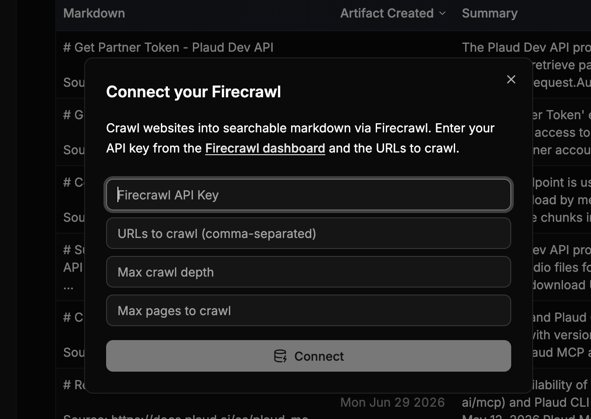

<Note>
  The following docs are all self-contained in the `Stoneturner Skill`.

  Read the docs and then get started with the Skill

  ```bash
  npx skills add jackmuva/stoneturner
  ```
</Note>

Each integration lives in its own directory under `src/integrations/` and exports two things:

1. `IntegrationConfig` - this describes how users should authenticate (OAuth, API Key, etc.) and any special configurations
2. `Integration` - the sync pipeline (for OAuth integrations, this includes redirect handler and refresh token mechanisms)

## 1. Project Setup 

Clone (and star :)) the Stoeturner repo.

```bash
git clone https://github.com/jackmuva/stoneturner.git
cd stoneturner
bun install
```

<Note>
  See the [Quickstart for running Stoneturner locally](/quickstart#option-2-running-stoneturner-locally) for any help getting the bun project up and running
</Note>

While this isn't a requirement, you/agents can reference existing integrations to build your new integration extremely quickly.

```bash standard template
src/integrations/my-integration/
  config.ts
  integration.ts
  db/
    schema.ts
    queries.ts
  models/
    models.ts
  sync-steps/
    sync-data-step.ts
    parse-step.ts
```

## 2. `IntegrationConfig` Definition

In `config.ts`, export a config that describes how users authenticate. 

```ts config.ts
import type { IntegrationConfig } from "@/core/models/models";

export const myConfig: IntegrationConfig = {
  integration: "MyIntegration",
  icon: "/assets/my-integration.png",
  integrationType: "OAUTH",        // "BASIC_TOKEN" | "OAUTH" | "API_KEY"
  description: "My integration description", //Will be rendered in the front end
  docs: "https://docs.my-integration.com/api",
  inputs: [                                              // optional — token/key fields the user enters
    { input: "accessKey", label: "Access Key" },         // allowed keys: accessKey, secretKey, baseUrl
    { input: "secretKey", label: "Secret Key" },
    { input: "baseUrl", label: "API Base URL" },
  ],
  optionInputs?: {
    key: "field",
    label: "Optional field",
  }[],
  oauthAuthorizationUrl: "https://app.my-integration.com/oauth/authorize", // optional, but required for OAuth
};
```

<Note>
  Inputs are rendered on the frontend so you can input API Keys, Client Secrets, and other configurations for Stoneturner to use during syncs

  
</Note>

## 3. `Integration` Definition

In `integration.ts`, export an `Integration` object with your sync pipeline:

```ts integration.ts
import type { Integration } from "@/core/models/models";
import { myConfig } from "./config";

export const myIntegration: Integration = {
  config: myConfig,
  sync: async () => { /* full sync */ },
  syncUpdates: async () => { /* incremental sync */ },
  deleteSync: async () => { /* clean up all data */ },
  handleRedirect: async (req) => { /* handle OAuth redirect */ },
  refreshAccessTokens: async () => { /* refresh OAuth tokens */ },
};
```

<Tip>
  Your sync functions should generally follow the standard pipeline: 
  1. Sync data
  2. Parse synced data to Markdown
  3. LLM step to extract insights for search
  4. Index vector database (embed + upsert)`. 

  ```typescript
  export const syncDiscordPipeline = async (incremental: boolean = true, db: SqliteDb) => {
    await syncChannels(db);
    await syncMessages(incremental, db);
    await parseDiscordMessages(incremental, db);
    await indexVectorDbStep("discord", incremental, db);
  }
  ```
  <Note>
    Syncs also upport incremental updates (i.e. you don't want to re-sync all data every day, incremental updates allow you to sync only new records).
  </Note>
</Tip>

## 4. Database Schemas and Migrations

Add your integration's tables in `src/integrations/my-integration/db/schema.ts`. Each table should give every row a stable, unique business key (e.g. `callId`) and use `onConflictDoUpdate` in its insert helpers so re-syncs upsert rather than duplicate.

Then point Drizzle at your new schema in `drizzle.config.ts` so your schema changes will be available in Stoneturner's Turso DB.

```ts drizzle.config.ts
export default defineConfig({
  schema: [
    './src/core/db/schema/*',
    './src/integrations/gong/db/schema.ts',
    './src/integrations/my-integration/db/schema.ts',   // add yours
  ],
  // ...
});
```

Finally, generate and apply migrations:

```bash
bun run generate
bun run migrate
```

This updates the local `stoneturner.db`. In dev mode (`BUN_PUBLIC_DEV_MODE=true`), a separate test database is created so you can iterate without affecting production data.

## 5. Register Your Integration

Add your config to `src/integrations/config-registry.ts`:

```ts config-registry.ts
import { myConfig } from "./my-integration/config";

export const configRegistry: IntegrationConfig[] = [
  gongConfig,
  myConfig,    // add yours
];
```

Add your integration to `src/integrations/sync-registry.ts`:

```ts sync-registry.ts
import { myIntegration } from "./my-integration/integration";

export const supportedIntegrations: Integration[] = [
  gongIntegration,
  myIntegration,    // add yours
];
```

<Note>
  The config registry powers the frontend credential UI; the sync registry powers sync dispatch. An integration must be in both to be fully wired up.
</Note>


