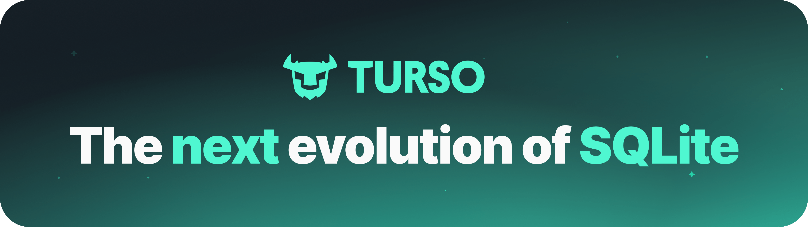

## Stoneturner Components

<Columns cols={2}>
  <Card title="React Client">
    UI to monitor syncs, view markdown, and authenticate to data sources
    ```jsx
      <Route element={<Layout />}>
        <Route path="/" element={<KnowledgeBasePage />} />
        <Route path="knowledge" element={<KnowledgeBasePage />} />
        <Route path="knowledge/config/:integration" element={<KnowledgeBasePage />} />
        <Route path="knowledge/data/:integration" element={<IntegrationDataPage />} />
        <Route path="monitoring" element={<SyncMonitoringPage />} />
      </Route>
    ```
  </Card>
  <Card title="MCP Server" >
    Tools for agents to search all of your context efficiently
    ```typescript
    export const tools: McpTool[] = [
      {
        name: "semantic_search",
        description:
          `Semantic search across indexed call content,
          extracted key points, and questions answered.
          Returns the most relevant artifacts ranked by similarity,
         ...`
    ```
  </Card>
  <Card title="Integrations">
    Integrated data sources to sync
    ```typescript
    export const gongIntegration: Integration = {
      config: gongConfig,
      sync: async(db: SqliteDb) => await syncGongPipeline(false, db),
      syncUpdates: async(db: SqliteDb) => await syncGongPipeline(true, db),
      deleteSync: async(db: SqliteDb) => {
        await deleteSyncTasksByIntegration("Gong", db);
        await deleteMdArtifactsByIntegration("Gong", db);
        await deleteEmbeddingByIntegration("Gong", db);
        await deleteAllGongData(db);
      }
    }
    ```
  </Card>
  <Card title="Core Services" >
    Turso DB storage, vector embeddings, CRONs, rate limitting
    ```typescript
      export const searchContentEmbeddingByCosine = async (
        queryEmbedding: number[],
        limit: number = 5,
        filters?: EmbeddingSearchFilters,
        db: SqliteDb = defaultDb,
      ) => {
        const distance = sql<number>`vector_distance_cos(${contentEmbedding.embedding}, vector32(${JSON.stringify(queryEmbedding)}))`;
    ```
  </Card>
</Columns>

## Project structure

```
src/
  core/
    db/              # Database connection, queries, and schemas (relational + vector)
    handlers/        # HTTP + MCP request handlers
    middleware/      # CORS middleware (note: directory is "middlware")
    models/          # Shared type definitions
    services/        # Embedding, vector indexing, MCP server, tools
  integrations/
    config-registry.ts   # Frontend UI config for all integrations
    sync-registry.ts     # Sync dispatch for all integrations
    gong/                 # Gong integration
      config.ts           # IntegrationConfig definition
      integration.ts      # Integration object (sync pipeline, delete)
      db/                 # Gong-specific schemas and queries
      models/             # Gong API response types
      sync-steps/         # Individual sync pipeline steps
    .../
  client/               # React SPA (monitoring + credential config)
  index.ts              # Bun.serve() entry point with all routes
```

## Technology Choices

### Turso's SQLite Rewrite

Stoneturner uses [Turso](https://turso.tech) for local database storage and retrieval. With the embeddable advantages of SQLite, Turso extends SQLite by adding concurrent writes and vector search.



Rather than run a separate vector database, Turso keeps the database layer lightweight, local, and unified to search semantically or with SQL.

### Vercel AI Gateway for Embedding Models and LLM Extraction

Many "LLM Gateway" products exist. Vercel supports both embedding models use to process text to index to Turso, and LLMs to run a quick task to extract insights from synced data.

I borrowed this idea from [enzyme.garden](https://enzyme.garden), where semantic data should have a complilation step to prep semantic data for search. When vector searching, matching questions and insights provide better search quality over matching content alone.

Stoneturner also extract entities (like tags) for an agent to filter and follow connections like a graph database.

### Bottleneck for Rate Limit Control

[Bottleneck](https://github.com/SGrondin/bottleneck) is a lightweight javascript library to schedule jobs and "bottleneck" function calls. This is extremely useful for respecting external API rate limits. Syncs call 3rd-party APIs over and over. Bottleneck lets us control concurrent requests and backoffs.

```typescript
import Bottleneck from "bottleneck";

export const aiGatewayBottleneck = new Bottleneck({
  maxConcurrent: 5,
  minTime: 200
});
```

### Unified Integration Interface

Integrating with 3rd-party APIs are notoriously cumbersome. We keep it simple by boiling 
down 3rd-party syncs to their primitives, providing a recipe for building reliable 3rd-party
syncs.

```typescript
export type Integration = {
  config: IntegrationConfig,
  sync: (db: SqliteDb) => Promise<void> | void,
  syncUpdates: (db: SqliteDb) => Promise<void> | void,
  deleteSync: (db: SqliteDb) => Promise<void> | void,
  handleRedirect?: (req: BunRequest, db: SqliteDb) => Promise<Response> | Response,
  refreshAccessTokens?: (db: SqliteDb) => Promise<void> | void,
}
```

This process is so repeatable, you can extend Stoneturner in minutes with a coding agent, 3rd-party docs, and 
the Stoneturner Skill.

<Note>
  Let's set up Stoneturner locally and [build your own integration](/add-integrations) sync in just a few steps!
</Note>


