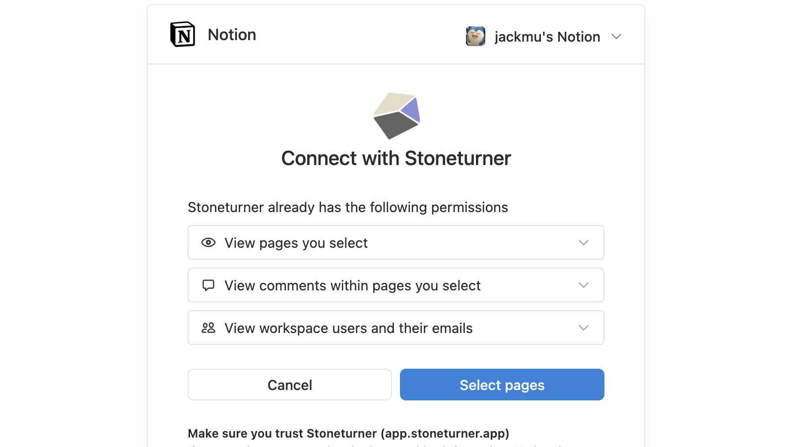
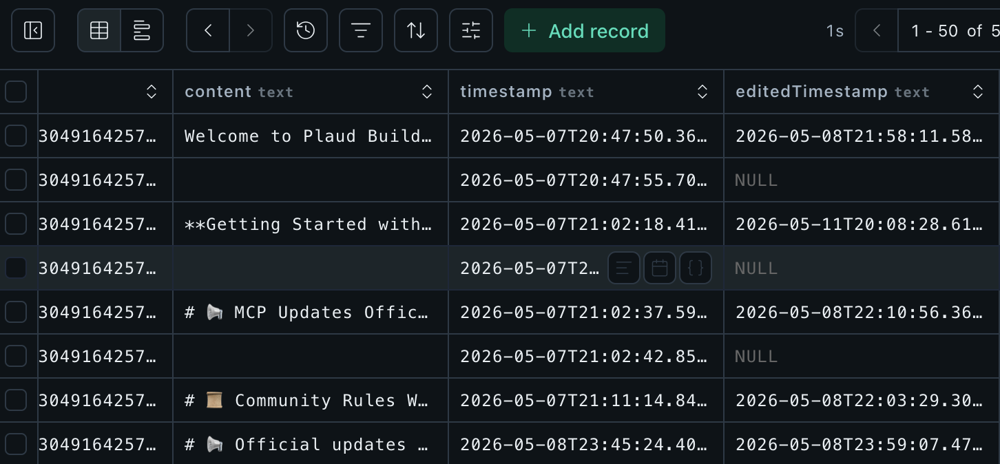
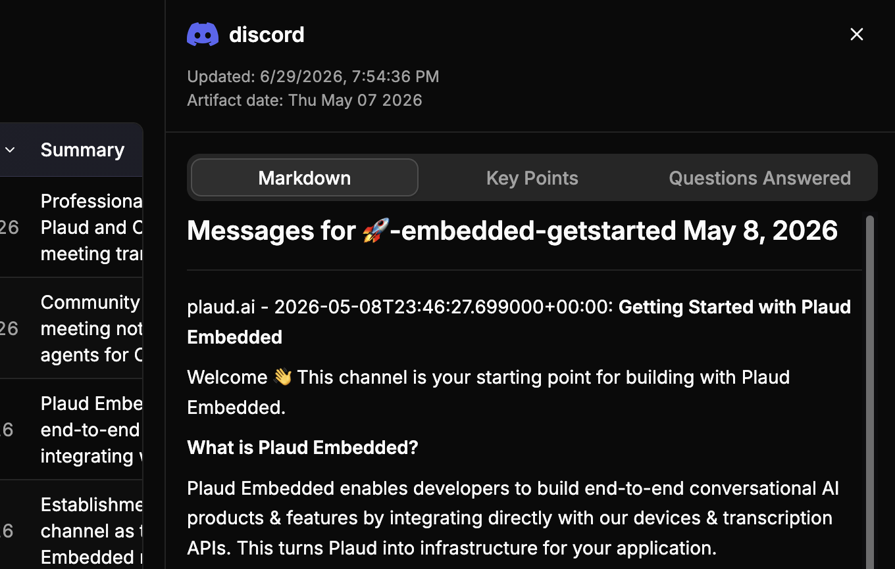
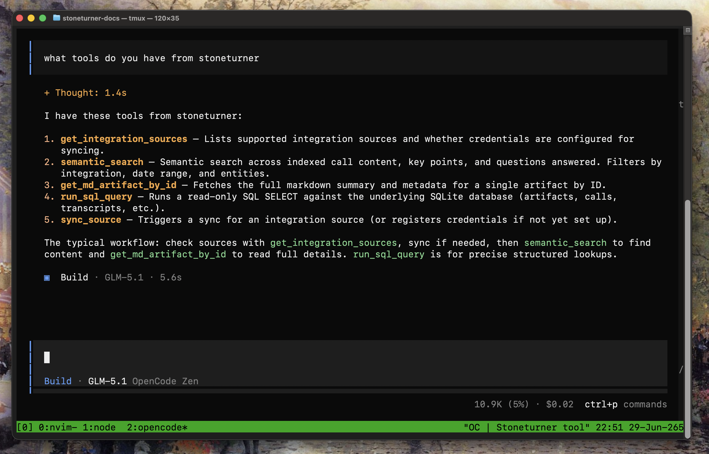

<Steps>
  <Step title="Managing Data Connections">
    Stoneturner supports OAuth, Basic Auth, and API Keys to connect to your integration data. We manage and refresh your credentials to keep your data in-sync.

    
  </Step>
  <Step title="Reliable Syncing">
    Stoneturner fetches data from the integration provider with respect to rate limits, incremental updates, and stores the native data schemas.

    
  </Step>
  <Step title="Pre-processing for Optimized Search">
    Agents are at their most optimal when reading clean Markdown, writing scripts for well-defined schemas, and searching unstructured data semantically.

    Stoneturner does pre-processing using LLMs to extract insights and tags, vector embed content, and formatting everything from transcripts to message threads to Markdown.

    
  </Step>
  <Step title="Search">
    Stoneturner provides just 5 tools for agents to sync and search all of your synced data. No tool bloat. Just simple interfaces for agents to use intelligently.

    
  </Step>
</Steps>

<Tip>
  If you're interested in the technology that powers Stoneturner, read the [application architecture](/architecture), whether you'd like to extend Stoneturner or just curious to learn about agent search.
</Tip>
