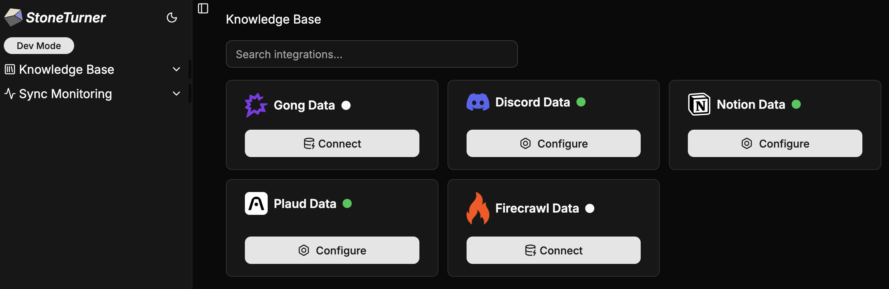
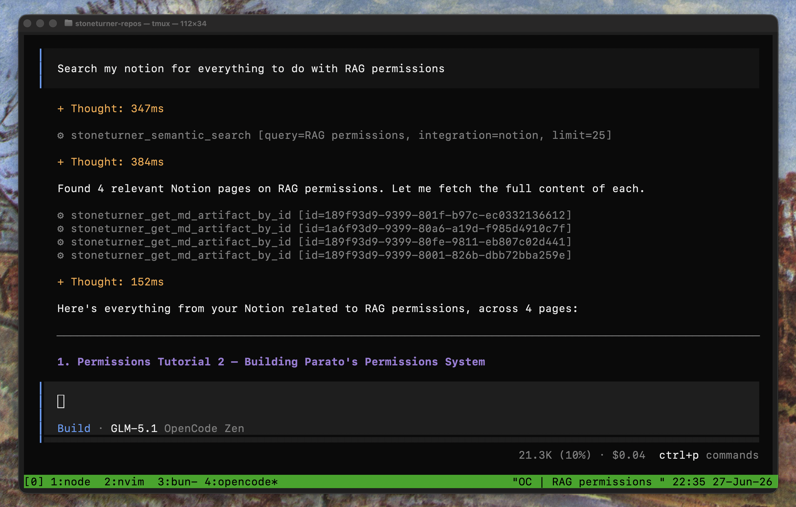

### Stoneturner **syncs** data from external data sources


### So your agents can search semantically or with SQL


--- 

## Why Stoneturner

Agents like Claude Code, Codex, OpenClaw are only as good as the context they have access to. Stoneturner solves 3 problems with 
using MCPs or tools for searching 3rd-party data.

```html
  1. Too many MCP tools eat up context -> worse agent performance <!-- [!code --] -->
  One MCP for all of your external data sources <!-- [!code ++] -->

  2. Not every 3rd-party have good MCPs for search <!-- [!code --] -->
  Syncs that pre-process and normalize external data to simple markdown and vectors <!-- [!code ++] -->

  3. Many MCPs can't be customized for your unique AI workflows <!-- [!code --] -->
  Stoneturner is completely open-source, extendable, and customizable<!-- [!code ++] -->
```

## Start Stoneturning!
<Columns cols={2}>
  <Card title="Connect to the Stoneturner MCP Now" icon="rocket" href="/quickstart">
    Use Stoneturner's **managed MCP** where we manage syncs and data storage for you
  </Card>
  <Card title="Run Stoneturner Locally" icon="computer" href="/quickstart#option-2-running-stoneturner-locally">
    Run Stoneturner completely locally - **no data touches any cloud services!**
  </Card>
</Columns>
